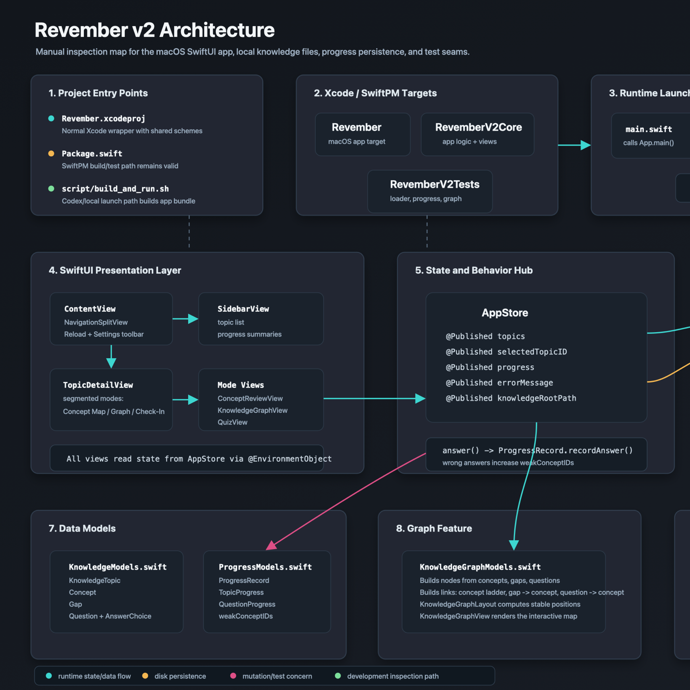

<p align="center">
  
</p>

<p align="center">
  <strong>A local-first macOS app for turning technical learning into evidence-backed review.</strong>
</p>

<p align="center">
  <a href="https://github.com/YashVG/revember_v2/actions/workflows/ci.yml"></a>
  <a href="LICENSE"></a>
  
  
</p>

# Revember

Revember helps you keep technical understanding durable. Learn from first principles, capture the concepts and misconceptions that matter, then review exactly what needs fresh evidence. Your knowledge, review history, and scheduling state remain readable local files—there is no account, backend, telemetry, or cloud sync.

## Start Here

**Requirements:** macOS 14+, Xcode 16 (or Swift 6), and standard macOS developer tools.

```bash
git clone https://github.com/YashVG/revember_v2.git
cd revember_v2
./script/set_project_knowledge_path.sh
./script/build_and_run.sh
```

The app opens with the included BLE learning module. Use its review flow to rate an answer, inspect the concept graph, and see why the next review is scheduled when it is.

Open `Revember.xcodeproj` when you prefer to run or debug from Xcode.

## What You Can Do

- **Learn with diagnostic checks.** Questions record correct and incorrect retrieval, including the misconception a distractor was designed to expose.
- **Review with transparent scheduling.** Every rating writes an immutable local event and derives the next interval with a small, inspectable scheduler.
- **Inspect the knowledge graph.** Concepts, relationships, gaps, questions, and learner evidence are separate layers you can explore directly.
- **Keep the source of truth editable.** Notes are Markdown; app-ready lessons are versioned JSON; review progress is local JSON.
- **Use an optional MCP workflow.** Any compatible local MCP client can read learner evidence and safely update lessons through revision-checked tools.

<p align="center">
  <a href="docs/architecture/closed-loop-learning-system.md">
    
  </a>
</p>

## Make It Yours

The checked-in `RevemberKnowledge/` folder is a safe seed module. For private learning material, copy it somewhere writable, then select that folder from the app's Settings:

```bash
cp -R RevemberKnowledge "$HOME/Documents/RevemberKnowledge"
```

Keep your own notes and progress local by default. Generated MCP backups and personal learning-session files are intentionally ignored by Git.

## Optional MCP Server

The local stdio MCP server is optional; the app works without Node.js or an AI client. Install it only if you want to create or revise knowledge through Codex, Claude Desktop, or another MCP-compatible client:

```bash
npm --prefix mcp-server ci
npm --prefix mcp-server run check
```

See [the MCP guide](mcp-server/README.md) for client setup, available resources, mutation tools, revision checks, and session artifacts.

## Developer Guide

| Path | Purpose |
| --- | --- |
| `Revember.xcodeproj` | Native macOS app, core framework, and test targets |
| `Sources/` | App UI, models, scheduling, persistence, and system integration |
| `Tests/` | Swift test suite |
| `RevemberKnowledge/` | Seed Markdown and schema-v2 learning content |
| `mcp-server/` | Optional TypeScript stdio MCP server |
| `docs/architecture/` | System contracts and data-flow documentation |

Run the repository checks with:

```bash
swift test
npm --prefix mcp-server run check
git diff --check
```

For a no-signing Xcode build:

```bash
xcodebuild -project Revember.xcodeproj -scheme Revember -configuration Debug CODE_SIGNING_ALLOWED=NO build
```

## Documentation and Support

- [Architecture and data contracts](docs/architecture/closed-loop-learning-system.md)
- [Knowledge authoring workflow](RevemberKnowledge/LEARNING_WORKFLOW.md)
- [MCP server guide](mcp-server/README.md)
- [Contributing](CONTRIBUTING.md)
- [Security policy](SECURITY.md)

Questions, ideas, and bug reports are welcome through GitHub Issues. Please remove private learning data and local paths before posting.

## License

Released under the [MIT License](LICENSE).
