# Adaptive Learning Pipeline Scaffold

**Status:** Partially implemented. New review outcomes now preserve schedule-decision lineage. Queue, exposure, training, daily execution, and learned scheduling remain proposed.

**Decision:** Build a small, local, Modyn-inspired batch loop. Do not integrate Modyn or retrain the local LLM every day. Keep note indexing, content-generation feedback, and recall personalization as separate loops.

The supporting research is in [Modyn Fit Analysis](../modyn-fit-analysis.md). The current product boundary remains [Closed-Loop Learning Architecture](closed-loop-learning-system.md).

## Outcome

The first learnable outcome is:

> Estimate the probability that the learner will answer a question correctly after a given delay.

That estimate can later prioritize due questions or choose a review interval. It must not rewrite authored notes or silently replace the current scheduler.

Three input streams have different meanings. The responses below are proposed pipeline behavior, not all current product behavior:

| Input | What it changes | Proposed pipeline response | Not evidence for |
| --- | --- | --- | --- |
| New or edited note | Available knowledge | Preserve it; after the existing Finish lecture boundary, segment it and eventually refresh retrieval/index state | Recall-model correctness |
| Accepted, edited, or rejected generated question | Content-generation quality | Append a future content-feedback event | Learner memory by itself |
| Correct or incorrect review | Learner-memory estimate | Append revision-aware outcome evidence | LLM fine-tuning by itself |

The current product only accepts text typed or pasted into a note. Segmentation runs when the learner chooses Finish lecture; there is no retrieval index today. Local Ollama support organizes note sections and suggests editable distractors, not complete question generation or model fine-tuning. Document, image, and OCR ingestion require a separate import design before they can enter this flow.

## Proposed flow

```mermaid
flowchart LR
    notes["Note revisions"] --> finish["Finish lecture"]
    finish --> segments["Deterministic segmentation"]
    segments --> index["Future retrieval refresh"]
    notes --> authoring["Question authoring"]
    authoring --> contentFeedback["Future accept / edit / reject evidence"]

    decisions["Schedule decision<br/>after prior outcome"] --> queue["Queue / slate decision<br/>before selection"]
    queue --> exposure["Offered exposure<br/>at presentation time"]
    exposure --> disposition["Disposition<br/>answered / skipped / abandoned"]
    disposition --> reviews["Answer outcome<br/>when answered"]
    reviews --> wake["Daily eligibility check"]
    wake -->|"insufficient evidence"| noRun["Record no-training decision"]
    wake -->|"trigger fires"| snapshot["Immutable training snapshot"]
    snapshot --> train["Train candidate"]
    train --> replay["Chronological replay evaluation"]
    replay --> predictorGate["Predictor validation gate"]
    predictorGate -->|"validated"| shadow["Live shadow predictions"]
    predictorGate -->|"reject or inconclusive"| incumbent["Keep incumbent"]
    shadow --> orderTrial["Bounded already-due<br/>ordering trial"]
    orderTrial --> orderGate["Ordering trial gate"]
    orderGate -->|"pass"| dueTrial["Bounded due-date trial"]
    orderGate -->|"reject or inconclusive"| incumbent
    dueTrial --> policyGate["Scheduling-policy gate"]
    policyGate -->|"pass"| active["Electron adopts<br/>active-policy pointer"]
    policyGate -->|"reject or inconclusive"| incumbent
    active --> rollback["Retain rollback version"]
```

The daily process is a **check**. Most checks should legitimately finish without training.

## Current starting point

Revember already provides:

- a review-commit API that appends revision-aware events to the logical ledger in [`shared/types.ts`](../../shared/types.ts); the physical JSON file is atomically rewritten and is not tamper-evident append-only storage;
- deterministic scheduler replay in [`shared/domain.ts`](../../shared/domain.ts);
- per-file atomic progress persistence in [`electron/persistence.ts`](../../electron/persistence.ts), but no coherent snapshot transaction across progress, topics, and captures;
- a nested immutable `scheduleDecision` on each newly inserted review event, including the applied `simple-v1` result and immediate prior-decision chain;
- a `scheduleDecisionID` and `schedulerVersion` on the derived card projection;
- review time captured when the first answer is selected rather than when Save is clicked;
- revision-keyed, failure-isolated local note segmentation at the Finish lecture boundary;
- optional local note organization and distractor suggestions;
- a deterministic `simple-v1` incumbent scheduling policy.

`simple-v1` chooses intervals and due dates. It does not emit a recall probability, so log loss, Brier score, and calibration are undefined for it until a separate probability baseline is specified.

Revember does not yet provide:

- an initial schedule decision before a question's first outcome;
- queue/slate, offered-exposure, and disposition records;
- immutable historical note bodies;
- a durable note-section-to-question link;
- content-generation acceptance/edit/rejection events;
- training snapshots, run manifests, model artifacts, or an active-model pointer;
- shadow predictions or a promotion/rollback process;
- a recall-probability baseline;
- a reliable cross-platform daily executor.

An external job must never write `progress.json`. The Electron process owns in-memory progress and can overwrite an external mutation. A future trainer may read a verified coherent snapshot and write only separate derived artifacts.

## Logical components

These are contracts, not proposed microservices.

| Component | Responsibility | Required output |
| --- | --- | --- |
| Evidence recorder | Capture scheduling, queue selection, presentation, disposition, and answer without writing future facts into an earlier event | Linked immutable IDs and time-correct feature snapshots |
| Snapshot coordinator | Read a coherent view of independently persisted local stores | Store identities, cutoffs, hashes, and verification result |
| Eligibility builder | Convert review history into reproducible examples | Included event IDs and explicit exclusion reasons |
| Trigger policy | Decide whether a candidate run is justified | Triggered/not-triggered plus reason and counts |
| Selection policy | Choose eligible history | Versioned rule and selected IDs/weights |
| Trainer | Fit one candidate deterministically | Candidate artifact and training diagnostics |
| Replay evaluator | Score incumbent and candidate on the same future windows | Per-window metrics and active-model mapping |
| Shadow evaluator | Record predictions without changing review timing | Paired predictions linked to future outcomes |
| Predictor gate | Decide whether a candidate is trustworthy enough for shadow use | Validate, reject, or remain inconclusive |
| Policy gate | Decide whether to start or expand a scheduling intervention | Trial, promote, reject, or remain inconclusive |
| Model registry | Preserve candidates, active version, and rollback | Immutable manifests and atomic active pointer |

Modyn inspires the trigger, selection, replay, and version concepts. The causal event contracts, predictor and policy gates, activation semantics, and rollback are Revember additions.

## Evidence contracts

### Linked schedule, queue, exposure, disposition, and outcome records

One event cannot honestly contain both a decision and facts that become known later. Use linked immutable records, each written when its facts become available.

**Schedule decision:** record immediately after a review or initial scheduling action:

- decision ID and decision time;
- topic ID, question ID, and question revision;
- prior card state and review count;
- chosen interval, intended due time, and reason;
- scheduling-policy version, parameter/artifact version, and feature-schema version;
- any recall prediction available at that time.

Current implementation covers the post-review subset. The decision is nested on its source `ReviewEvent`, uses a deterministic ID, links the immediate prior review and decision when available, and snapshots the resulting card state. `reviewedAt` records first-answer time; `decidedAt` records the later main-process commit. The due date remains anchored to first-answer time. The main process writes the outcome, decision, and card projection in one atomic progress update. Existing events remain unbackfilled, and `simple-v1` has no probability or model artifact to record.

**Queue/slate decision:** record before selecting the first card in a review session or recomputing the queue:

- queue-decision ID and timestamp;
- the complete eligible card/revision set considered;
- per-card scores or priority inputs, resulting order, selected card, and tie-breaker;
- exclusion reasons, session constraints, and queue-policy version;
- trial arm and assignment probability when an intervention is running.

This record is required for an already-due ordering trial. A later exposure alone cannot reveal which alternatives the ranker considered.

**Offered exposure:** append when the question is actually shown:

- exposure ID, linked schedule-decision ID, and linked queue-decision ID, or an explicit reason either link does not exist;
- question revision and source-provenance hashes available at presentation;
- actual presentation time and elapsed time since the prior answer;
- queue reason: new, revised, overdue, scheduled early, manual, or already-due reordering;
- the policy version that selected or ranked the card;
- a shadow prediction, if one was produced before the answer.

**Disposition:** append later with the exposure ID, timestamp, and answered, skipped, or abandoned result. Never mutate the earlier offered exposure with this future fact.

**Review outcome:** when the disposition is answered, the existing `ReviewEvent` remains the answer evidence and links to the exposure ID. Correctness, response time, and inferred rating are recorded only after the answer.

The active policy and feature contract are pinned for an open question. Activating a new candidate cannot change the policy used when that question's answer is committed. Offered exposures and every terminal disposition are needed before a ranker can be evaluated honestly.

### Content-generation feedback event

Keep this separate from memory outcomes:

- source note revision and source blocks;
- model, prompt, schema, and generation ID;
- generated question/choice IDs;
- accepted unchanged, edited, rejected, retired, unsupported, ambiguous, or duplicate;
- final authored revision.

A wrong learner answer does not necessarily mean the generated question was poor. A rejected or unsupported question does not measure learner memory.

### Training snapshot

Each run freezes:

- event cutoff time;
- knowledge-root and progress-store identities;
- a verified, coherent set of progress, topic, capture, and source hashes;
- included and excluded event IDs;
- source content hashes;
- target definition;
- feature-schema version;
- trigger and selection-policy versions;
- candidate model family and configuration;
- deterministic seed;
- code/application version.

### Run manifest

Each check records a manifest, including checks that do not train:

- run ID, start/end time, and status;
- trigger decision and evidence counts;
- selected snapshot ID;
- incumbent and candidate versions;
- training diagnostics;
- per-window evaluation metrics;
- promotion decision and failed gate conditions;
- artifact hashes and rollback target.

Legacy `ReviewEvent` records predate schedule-decision instrumentation and remain visibly uninstrumented. New events preserve the policy output that follows the outcome, but they still do not establish what was offered, ranked, predicted, or skipped before that outcome. Policy-promotion evidence therefore still requires the planned queue, exposure, and disposition contracts.

## Initial policies

### Trigger policy v0

Run the coordinator after at least 24 hours has elapsed, then catch up when the app or helper next becomes available. Do not promise exact wall-clock execution while the machine is asleep or the app is absent.

Use a simple amount trigger with a maximum staleness check. The coordinator trains only when all integrity checks pass and the configured minimums for new eligible transitions, distinct cards, distinct study days, and elapsed-time coverage are met. It records a no-training decision otherwise. A first implementation should expose and record these knobs instead of hiding them in model code.

Illustrative launch safeguards are 100 new eligible delayed transitions, 30 distinct cards, 14 distinct study days, and observations in at least two non-same-session delay ranges. These are deliberately conservative placeholders, not statistically justified constants. Profile real event volume and learning-curve uncertainty before freezing them.

Those safeguards permit only a fit attempt. They do not imply evaluation or promotion sufficiency. Each candidate may add requirements such as minimum recalled/forgotten outcomes, FSRS grade diversity, or a temporally separate calibration subset; every requirement belongs in the run manifest.

Keep three sufficiency decisions separate:

1. **Training sufficiency:** enough distinct cards, study days, and delay coverage to fit a candidate.
2. **Evaluation sufficiency:** enough later, non-overlapping blocks to estimate predictive quality with uncertainty.
3. **Promotion sufficiency:** enough post-instrumentation, intervention-relevant evidence to change behavior.

Repeated answers from one card or one study day are correlated. Raw event count can therefore overstate information; report unique-card/day counts and a clustered or block-based effective sample size. Both outcome classes are required for discrimination metrics, but an otherwise valid single-class window may still contribute to proper scoring rules.

There is no defensible universal event count. Until the volume audit and evaluation gates pass, retain fixed/default parameters. Current [Anki FSRS guidance](https://docs.ankiweb.net/deck-options.html#fsrs) treats optimization as occasional maintenance rather than something required every day; that is a better starting posture than nightly refitting.

Do not use note-embedding drift as the first trigger. It confuses a change in subject matter with a degradation in recall prediction.

### Selection policy v0

Use all eligible history. Compute is negligible at this scale, and the data is sparse.

Eligibility requires:

- features captured before the outcome;
- a known question revision;
- a reproducible elapsed interval;
- an observed delayed outcome;
- a declared treatment for same-session retries;
- no missing policy or feature version for post-instrumentation evidence.

A schedule decision is not labeled until its follow-up review occurs. Keep decisions with no mature follow-up as pending/right-censored, report their count and age, and never convert them into failures or silently remove them. Any interval-changing trial must run long enough for the longest promoted interval to mature, or predeclare a shorter eligible interval range.

Build three explicit cohorts:

- **Legacy exploratory cohort:** existing outcomes whose schedule can only be reconstructed under declared `simple-v1` assumptions. Use this to check feasibility and fit rough baselines, not to prove promotion safety.
- **Schedule-lineage cohort:** new outcomes with an immutable post-answer scheduling result but no offered-exposure, queue, or disposition record. Use it to audit scheduler outputs and, after a later linked outcome matures, construct limited delay/outcome transitions.
- **Exposure-linked cohort:** future outcomes linked to actual pre-answer treatment, queue, exposure, and disposition records. Only this cohort can support shadow comparison or a policy-promotion claim.

Keep older question-revision events in the audit ledger. Their use in global parameter fitting must be explicit; they must not silently update current revision-specific card state.

Do not balance outcomes by dropping common examples. Report performance by outcome, interval, topic, question age, and source type. If training uses weights, evaluate on the natural observed distribution.

## Candidate hierarchy

Evaluate the least complex candidate that can answer the product question. Keep probability prediction, due-date scheduling, and queue ordering as separate capabilities.

| Candidate | Use now? | Reason |
| --- | --- | --- |
| `simple-v1` scheduling policy | Yes, incumbent | Transparent, deterministic, and already deployed; not a probability predictor |
| Constant historical-recall predictor | First probability baseline | Exposes whether a candidate beats the base rate at all |
| Elapsed-time-bin or fixed exponential predictor | Second probability baseline | Tests whether delay alone explains most useful signal |
| FSRS with version-pinned default parameters | First domain challenger | Can run without personal fitting and emits a memory-state prediction |
| User-selected retention/workload control | Early product alternative | Gives useful control without claiming personalization |
| Calibration-only FSRS adjustment | After shadow evidence | Use an intercept-only or tightly constrained logit recalibration on a separate temporal calibration slice; flexible calibration will overfit sparse history |
| Periodically optimized FSRS | After sufficient history | Personalizes a structured model without building a general ML platform |
| Reorder already-due questions | First policy trial | Changes priority without extending due dates |
| Half-life regression or calibrated logistic model | Later, shadow only | Interpretable probability target, but needs diverse delayed outcomes |
| Online/incremental model | Deferred | Batch refitting is cheap, reproducible, and easier to roll back |
| Contextual bandit | Rejected for now | Historical logs contain feedback only for chosen actions and lack exploration probabilities |
| Daily local-LLM fine-tuning | Rejected for now | Notes are not labels; Modyn does not validate generative training; cost and evaluation are unjustified |
| Full Modyn runtime | Rejected for now | Multi-component orchestration, sample-level storage, and neural-training machinery do not match the workload |

FSRS compatibility still needs an experiment. Default FSRS can execute without personalization, but that does not validate Revember's automatically inferred grades. Pin the FSRS algorithm/library version, default parameters, desired-retention setting, interval semantics, and grade mapping in every benchmark. An incorrect answer must map to Again, never Hard. Revember's response-time mapping among Hard, Good, and Easy for correct answers must be benchmarked rather than assumed valid.

## Evaluation protocol

### 1. Prediction evaluation

Use rolling-origin replay:

1. Train on all eligible events before cutoff A.
2. Process held-out events from A to B in timestamp order.
3. For each event, predict first, then reveal its outcome and update that card's state before the next event. Do not refit global parameters unless the replayed trigger policy would have fired.
4. Advance both cutoffs.
5. Repeat across multiple future windows.
6. Compare incumbent and candidate on identical events.

Fit normalization, calibration, feature extraction, and every other learned preprocessing step using past data only. If a separate calibrator is used, fit the base model on an earlier prefix, the low-parameter calibrator on a later temporal slice, and score both on a still-later test block. Prefer non-overlapping evaluation blocks; if windows overlap, account for the dependence rather than treating every score as independent. Repeated observations should be blocked or clustered by study day and card when estimating uncertainty.

This is prequential evaluation for a stateful scheduler: the current outcome is hidden until its prediction, but becomes legitimate history afterward. Freezing all card state for the whole A-to-B block would not reproduce production behavior.

Use two availability mappings and label them clearly:

- **Production audit:** use the predictor actually adopted before each event.
- **Offline pipeline replay:** use the predictor that the simulated trigger, training duration, and activation rule would have made available before each event.

Never let a future-trained model score an earlier event. `simple-v1` has no probability output, so it belongs in scheduling-policy analysis, not a probability-score table. Prediction candidates compare against the constant, delay-bin, and fixed-forgetting-curve baselines.

Predeclare Brier score as the primary prediction metric for the first experiment. Measure:

- Brier score as primary;
- log loss as a tail-risk guardrail;
- calibration/reliability plots with bin support and uncertainty;
- recall discrimination as a secondary metric only where both outcomes exist;
- metrics by elapsed interval, topic, question age, revision status, and content source;
- training duration, artifact size, and failure rate.

Accuracy alone is unsafe. A scheduler can make accuracy high by reviewing everything immediately.

### 2. Shadow evaluation

The challenger predicts on live review events while `simple-v1` still controls timing. This yields paired future predictions without changing learner experience.

Shadow evaluation can establish predictive calibration under the incumbent's behavior. It cannot prove that the challenger's different intervals improve learning.

### 3. Policy evaluation

Scheduling changes which questions appear and when they are answered. Historical data therefore lacks the counterfactual outcome for a different interval.

Offline schedule replay may estimate queue size and workload under explicit assumptions, but it cannot establish the unobserved correctness outcome at a different delay. A simulator is planning evidence, not promotion evidence.

Only after shadow success should Revember consider a conservative online comparison. The safest first intervention is ordering questions that are already due while leaving their due dates unchanged. Extending or shortening intervals comes later and requires a bounded, consented policy trial. It must measure:

- achieved retention;
- reviews and active study minutes;
- lapse rate;
- overdue load;
- user overrides or abandoned sessions;
- errors at long intervals.

Predeclare one policy objective. The recommended first objective is retention non-inferior to `simple-v1` within a practical margin while reducing reviews or active study minutes. The alternative—higher retention at equal workload—is valid only if selected before the trial. Treat all remaining measures as safety guardrails.

For a single learner, use randomized card/session blocks or a predeclared incumbent/challenger crossover, and log assignment probabilities. A before/after comparison is confounded by changes in courses, exams, card difficulty, and study habits. Without a defensible comparator assignment, a trial can show operational safety but not superiority.

A contextual bandit would additionally require deliberate exploration and logged action probabilities. That is outside the first scaffold.

## Validation and promotion gates

Integrity, prediction quality, and intervention quality are different decisions.

### Gate 0 — Integrity

Reject the artifact if its snapshot, source-store identities, feature contract, run manifest, version pins, or hashes are incomplete or inconsistent. “More data needed” cannot repair a lineage failure.

### Gate 1 — Predictor validation

A candidate may become a validated shadow predictor only when it beats appropriate probability baselines on repeated future blocks, improves the predeclared primary Brier score without a material log-loss or calibration regression, and shows no important collapse by interval range or supported content slice. Insufficient future evidence is **inconclusive**; a clear repeated regression is **rejected**.

This gate authorizes prediction and continued shadow logging only. It says nothing about whether candidate-chosen intervals improve learning or workload.

### Gate 2 — Bounded already-due ordering trial

After shadow validation, a separate decision may authorize ordering already-due cards. Specify the incumbent comparator, randomized or defensible crossover assignment, assignment probabilities, trial population, duration, outcome-maturity rule, stop conditions, user control, action logging, and rollback before it starts. A simulated workload estimate can reject an obviously poor proposal but cannot approve it.

### Gate 3 — Bounded due-date trial

Success at queue ordering does not validate a different interval. A separate, narrower trial may change future due dates for a predeclared interval range only after Gate 2 passes. It uses the same comparator and assignment discipline and must remain open until its eligible long-delay outcomes mature.

### Gate 4 — Scheduling-policy promotion

Promote due-date behavior only after its own trial shows the predeclared retention/workload objective and acceptable lapse rate, overdue load, long-interval errors, and user overrides. Compare practical margins and uncertainty, not only a point estimate. Insufficient evidence remains **inconclusive**; a clear safety or learning regression is **rejected**.

The exact statistical and practical margins remain an open decision until real event volume is known. Small samples must not relax a gate.

The safest activation rule is **future-only**: a new policy affects a card when its next schedule decision is created. **Full replay** is a later option and must run inside an Electron main-process transaction or adopt a separate derived schedule store. It needs a ledger-hash compare-and-swap check before atomically replacing schedules. An external helper must never replay directly into `progress.json`.

The policy version is pinned at decision and exposure time. An already-open question finishes under that pinned version. A candidate pointer is adopted only at a safe boundary after compatibility and artifact checks; a missing or corrupt candidate falls back to `simple-v1`. Mixing versions without this declared transition rule is invalid.

After promotion, continue monitoring data integrity, achieved retention, workload, lapse rate, and prediction calibration in fixed windows. Predeclare automatic rollback thresholds and minimum support. An integrity failure reverts immediately at the next safe boundary; a repeated learning/workload breach reverts after its confirmation rule. Merely retaining an old artifact is not a rollback system.

## Daily execution choice

“Every 24 hours” is an eligibility service-level goal, not part of the learning algorithm.

| Mechanism | Strength | Limitation | Verdict |
| --- | --- | --- | --- |
| App launch/resume plus a 24-hour staleness check | Smallest surface; Electron remains the data owner | Nothing runs while the app stays closed | Start here |
| Idle timer while Revember is open | Can catch up during normal use | Not an independent background job | Add to the same coordinator |
| Thin OS-native launcher | Can run while the UI is closed and invoke a read-only trainer | Separate setup for macOS, Windows, and Linux; sleep still shifts timing | Optional after the pipeline proves useful |
| Traditional `cron` | Familiar on an always-on Unix machine | Not cross-platform; brittle desktop environment and sleep behavior | Development-only, not the product contract |
| Always-running Electron/tray process | Immediate access to app state | Energy, startup, and lifecycle cost | Unnecessary for sparse daily work |

The recommended contract is: check on launch, resume, and an idle interval; if the last completed check is older than 24 hours, run once. Use a lock and last-success marker so concurrent wakeups are idempotent. If closed-app execution later matters, add a platform launcher that invokes the same coordinator. Timing must never change whether a particular snapshot, candidate, or promotion is valid.

## Local execution and failure boundaries

- Treat “daily” as at-least-once when the device next becomes available, not a precise cron guarantee.
- Build a coherent snapshot across independently atomic files: record the knowledge root and progress-store identities, read their version/hash set, copy the selected inputs, then reread the identities and hashes. Retry if anything changed during the copy.
- Write candidates and run records to a separate derived-artifact location.
- Never let training failure block note saving, question authoring, or reviews.
- Require the frozen snapshot and artifact hashes to self-verify, confirm that the live store identity and schemas remain compatible, and apply an explicit staleness limit. New post-cutoff events do not invalidate a future-only candidate; exact live-ledger equality is required only for a full-replay compare-and-swap migration.
- Let Electron validate and adopt an atomic active pointer only at a safe startup or between-question boundary; keep the previous compatible version recoverable.
- Define deletion as an erasure workflow, not just invalidation: remove snapshots, run inputs, shadow records, and candidate artifacts containing deleted evidence; move active/rollback pointers away from affected artifacts; then refit from retained evidence or fall back to `simple-v1`. True removal from an already-fit artifact otherwise requires retraining or machine unlearning.
- Cap CPU, memory, and battery use; defer work while the learner is reviewing.
- Keep Ollama inference and scheduler training independently optional.

## Staged roadmap

### Stage 0 — Define the experiment

**Work:** Fix the first target as next-review recall probability. Define same-day retry treatment, probability baselines, and `simple-v1` as the scheduling-policy baseline.

**Done when:** One written target, separate prediction and policy baselines, and one metric set exist. No model is trained.

### Stage 1 — Make evidence reproducible

**Work:** Add linked schedule-decision, queue/slate, offered-exposure, disposition, and outcome lineage; immutable note provenance; content-feedback evidence; coherent snapshot rules; and run-manifest contracts.

**Done when:** A future outcome can be reconstructed using only information captured before that outcome. Historical omissions are explicit.

**Current:** Post-review schedule decisions are implemented and legacy gaps remain explicit. Queue/slate, offered exposure, disposition, immutable note history, and run manifests are not implemented.

### Stage 2 — Build an observational prediction benchmark

**Work:** Compare constant, delay-only, fixed-forgetting, default FSRS, and later custom predictions across shared chronological windows. Describe legacy reconstruction assumptions separately. Report `simple-v1` scheduling and workload statistics outside the probability comparison.

**Done when:** The same event snapshot deterministically produces the same per-window metrics, uncertainty respects repeated-card/day dependence, and no future data leaks into preprocessing or fitting.

### Stage 3 — Add the daily check and shadow challenger

**Work:** Run eligibility checks, train only when triggered, persist no-training decisions, and record shadow predictions.

**Done when:** Repeated runs are idempotent, failures do not affect reviews, and the incumbent remains the only decision maker.

### Stage 4 — Trial already-due ordering

**Work:** Apply the predictor gate, then run a bounded, assigned incumbent/challenger trial that only reorders already-due cards.

**Done when:** A candidate has stable future-window evidence, complete queue/slate records, mature post-instrumentation trial outcomes, clear stop conditions, and a tested rollback.

### Stage 5 — Consider due-date activation

**Work:** Only after a successful ordering trial, run a separate assigned comparison of future-only due-date decisions against the incumbent under explicit user controls.

**Done when:** Eligible delayed outcomes have matured; achieved retention and workload—not just simulation—meet the policy gate; activation occurs at a safe boundary; and monitoring can actually trigger the tested fallback.

### Stage 6 — Reassess complexity

Add recency weighting, sample selection, performance/drift triggers, online learning, or bandits only after a measured failure makes them necessary.

Full Modyn-style infrastructure becomes reasonable only if Revember has many learners or models, expensive repeated training, competing pipelines, or enough data that sample-level selection materially reduces cost.

## Open decisions

- What ranking objective, tie-breaker, and within-user assignment should the already-due ordering trial use?
- Should indexing remain explicitly Finish lecture-gated, and what retrieval index would actually consume the segments?
- Should same-day retries train the long-term recall model, a separate short-term model, or neither?
- Can old question revisions inform global learner parameters while remaining excluded from card-specific state?
- What is the natural minimum evaluation-window duration and outcome count?
- What practical retention non-inferiority and workload-improvement margins should the policy trial predeclare?
- How should automatically inferred ratings map to FSRS grades?
- Does activation affect only future reviews or replay all compatible histories?
- What user control is required for training, deletion, reset, and inspection of local models?
- What retention period and erasure guarantee apply to snapshots, models, and audit manifests?
- Which execution mechanism is reliable across macOS, Windows, and Linux without giving an external process write access to progress?

## Revisit the decision when

Reconsider the full pipeline only after the repository contains enough real, diverse review history to answer these questions:

- Do the probability baselines or FSRS predictions show a stable calibration problem, or does the `simple-v1` policy show a measured retention/workload problem?
- Does default or optimized FSRS fail on that same evidence?
- Does a custom candidate improve multiple future windows rather than one aggregate score?
- Is retraining cost high enough that selecting fewer examples matters?
- Are multiple model families or user populations now being managed?

If the answer remains no, retaining the transparent scheduler is the correct result.
