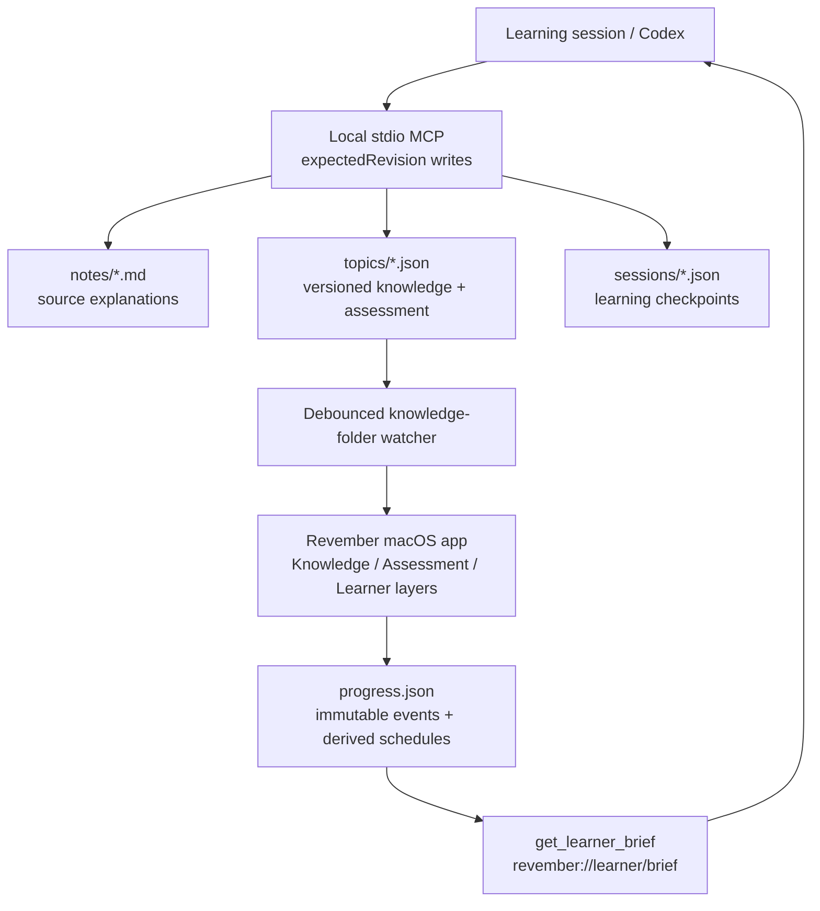

# Closed-Loop Learning Architecture

Revember keeps authored knowledge, learner evidence, and scheduling state local and separable. Codex changes the authored knowledge through a stdio MCP server; the macOS app watches those files, presents reviews, and writes progress; the MCP learner brief reads that progress back for the next learning session.



## Data Ownership

| Artifact | Owner | Mutation path | Role |
| --- | --- | --- | --- |
| `RevemberKnowledge/notes/*.md` | Knowledge base | MCP or direct editing | Human- and LLM-readable source explanation |
| `RevemberKnowledge/topics/*.json` | Knowledge base | Revision-checked MCP tools or direct editing | App-readable concepts, provenance, relationships, gaps, and checks |
| `RevemberKnowledge/sessions/*.json` | Knowledge base | `capture_learning_session` or Capture Checkpoint App Intent | Durable learning-session residue |
| `~/Library/Application Support/RevemberV2/progress.json` | App | Atomic `ProgressFileStore` saves | Review-event ledger, compatibility aggregates, and derived schedules |
| `RevemberKnowledge/.backups/` | MCP server | Automatic before replacing topic or note files | Recovery copies for authored content |

## Versioned Knowledge And Provenance

A topic is independently revisioned. `schemaVersion` identifies the contract; `revision` is a server-managed monotonic integer used for optimistic concurrency. Clients should read the current topic, pass that value as `expectedRevision`, and refresh after a conflict. Questions also have server-managed revisions: a new card starts at 1, and every `upsert_card` or `retire_card` increments both the card revision and its containing topic revision. Broad topic patches cannot replace the `questions` array.

The authored graph is explicit:

- `sources` holds stable source IDs plus source kind, title, locator, optional fingerprint, and capture time.
- `relationships` uses a stable ID, source and target concept IDs, one of `prerequisite`, `partOf`, `contrastsWith`, or `enables`, a rationale, and source references.
- Concept, gap, relationship, and question `sourceRefs` link authored claims and assessments to provenance.
- Gaps can name the misconception IDs that provide direct diagnostic evidence for that gap.
- Each question has a stable ID and revision, a diagnostic kind, transfer level, answer rationales, optional misconception IDs, and optional `retiredAt`.
- Retirement is a timestamp, not deletion, so old learner evidence remains interpretable.

Array position is presentation order only. The graph never infers meaning from adjacent concepts. Both the Swift loader and MCP validator reject future schemas, duplicate IDs, invalid answer keys, dangling concept references, and unknown source references before the app replaces its last valid snapshot. Files without version metadata retain legacy v1/revision 0 semantics.

## Evidence Graph

The in-app graph deliberately separates three layers:

1. **Knowledge:** concepts and authored semantic relationships.
2. **Assessment:** gaps, diagnostic questions, and the concepts each question assesses.
3. **Learner:** current review-card state and recent immutable review events.

Derived links such as “question assesses concept” and “event updates card state” are visually distinct from authored semantic relationships. Directional authored links have arrowheads; symmetric contrasts do not. Evidence states are `untested`, `fragile`, `developing`, or `stable`; correctness is authoritative and effort rating refines only correct evidence. A later successful retrieval can therefore repair a previously fragile concept without rewriting authored knowledge.

Evidence is revision-bound. An event and its derived card state carry the question revision they assessed. Advancing a question revision makes older evidence stale and queues the card for fresh retrieval; historical event nodes remain visible but no longer link to or validate the current card. The learner brief reports stale attempts separately from current attempts.

## Progress And Scheduling

Progress schema v2 has two first-class records:

```text
ProgressRecord
  schemaVersion
  topics[topicID]
    attemptsByQuestionID        legacy-compatible aggregates
    weakConceptIDs              legacy-compatible aggregates
    reviewCardsByQuestionID     derived schedule state
  reviewEvents[]                append-only evidence ledger
```

Each `ReviewEvent` has a UUID, topic and question IDs, question revision, selected and correct answer snapshots, prompt/kind/transfer snapshots, correctness, rating, concept IDs, gap tags, misconception IDs, source references, and review time. This keeps old evidence interpretable after authored content changes. Reusing the UUID is idempotent only for an identical payload; a mismatched reuse is rejected. The app first builds a candidate progress record, saves it atomically, and only then publishes it in memory.

Each `ReviewCardState` contains `questionRevision`, `schedulerVersion`, `dueAt`, `intervalDays`, `stability`, `difficulty`, `lastRating`, `lapses`, `reviews`, and `lastReviewedAt`. The current scheduler is intentionally transparent:

| Rating | First interval | Later interval |
| --- | ---: | ---: |
| Missed | 15 minutes | 1 day |
| Hard | 1 day | `max(1 day, previous x 1.2)` |
| Good | 2 days | `previous x 2.2` |
| Easy | 4 days | `previous x 3` |

An incorrect choice is always persisted and scheduled as `Missed`, even if the learner attempted to self-rate it Good or Easy. Free-recall probes hide answer cues until the learner explicitly reveals them for scoring.

The scheduler is injected through `ReviewScheduler`; event and card-state schemas already retain stability and difficulty. `reviewCardsByQuestionID` is a cache, not the canonical learning record: `ProgressRecord.rebuildReviewCardStates(using:)` replays each card's immutable, revision-bound history in review-time order and replaces only that cache. This is deliberately opt-in, so opening a file never silently reinterprets an existing scheduler's due dates. A future FSRS adapter can therefore replay the same history under its own version without changing topic IDs, event history, the due queue, or the UI contract.

The Check-In and Today flows show the exact persisted `dueAt` and interval returned by the scheduler after a review is saved; they do not infer a generic interval from the rating label. The MCP learner brief also exposes each card's `schedulerVersion` and the distinct current scheduler versions in the progress record.

Due reviews sort overdue scheduled cards first and unseen questions second. A three-minute session assumes 45 seconds per question, so it selects up to four items.

## Closed-Loop MCP

The MCP server exposes read resources for topics, notes, sessions, validation, and the derived learner brief. Its focused write tools include `upsert_concept`, `upsert_card`, `retire_card`, `update_markdown_explanation`, and `capture_learning_session`; broad topic creation and patch tools remain available. `validate_knowledge_base` checks all topics and sessions, declared note presence, topic/session consistency, and progress readability.

`capture_learning_session` can write a session, append a Markdown checkpoint, and advance the linked topic revision as one logical operation. If a later step fails, the newly written session and note append are rolled back. `get_learner_brief` folds the event ledger, card schedules, legacy aggregates, misconceptions, gaps, and recent sessions into a compact read model for the next lesson.

The server is registered globally as `revember`. Because MCP capability discovery happens when the client starts a task, rebuild the server and start a new Codex task or restart Codex after changing tools or resources.

## Live Reload And System Surfaces

`KnowledgeFolderWatcher` watches the knowledge root and `topics/`, coalesces editor save bursts, and asks `AppStore` to reload on the main actor. If decoding fails while an editor is mid-save, the app keeps its last known-good topics and reports the error. The watcher reattaches after a reload so atomic directory replacement remains observable.

The same review model is exposed outside the main window:

- the menu bar shows due state and starts a three-minute review;
- the Start Review App Shortcut opens a due-card session;
- the Open Topic App Shortcut and `revember://topic/<id>` deep link select a topic;
- Capture Checkpoint writes a schema-v1 session artifact without opening the app;
- notifications are opt-in and schedule a single next-review request;
- Spotlight indexes topic titles, summaries, concepts, and gaps with local deep links.

These surfaces route through the same app state and scheduler. They do not maintain independent review data.

## Failure Boundaries

- MCP writes validate IDs and paths, validate JSON before commit, write atomically, and back up replaced authored files.
- Topic mutations serialize within the MCP process, reject stale `expectedRevision` values, and keep topic/card revisions server-managed.
- Progress v1 is copied before automatic migration to v2; malformed progress is quarantined instead of overwritten.
- The app keeps the last known-good knowledge snapshot during a bad or partial topic save.
- Notification permission is requested only when the user enables review notifications.
