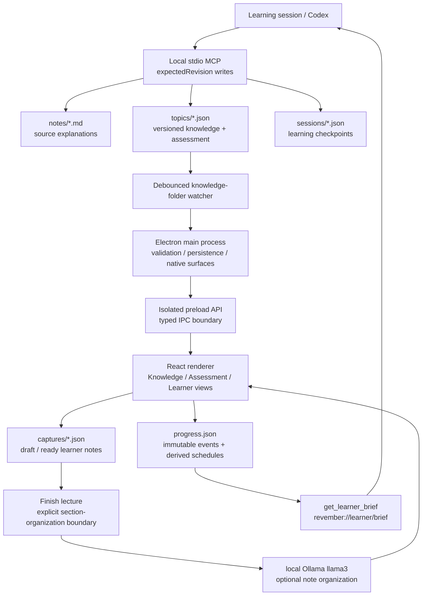

# Closed-Loop Learning Architecture

Revember keeps authored knowledge, learner evidence, and scheduling state local and separable. Codex changes authored knowledge through a stdio MCP server; the Electron desktop app watches those files, presents reviews, and writes progress; the MCP learner brief reads that progress back for the next learning session.



## Data Ownership

| Artifact | Owner | Mutation path | Role |
| --- | --- | --- | --- |
| `RevemberKnowledge/notes/*.md` | Knowledge base | MCP or direct editing | Human- and LLM-readable source explanation |
| `RevemberKnowledge/topics/*.json` | Knowledge base | Revision-checked MCP tools or direct editing | App-readable concepts, provenance, relationships, gaps, and checks |
| `RevemberKnowledge/sessions/*.json` | Knowledge base | `capture_learning_session` or the Electron checkpoint dialog | Durable learning-session residue |
| `RevemberKnowledge/captures/*.json` | App | Atomic Electron main-process saves | Exact draft/ready learner notes and locally generated topic notes |
| `~/Library/Application Support/RevemberV2/progress.json` | App | Atomic Electron main-process saves | Review-event ledger, compatibility aggregates, and derived schedules |
| `RevemberKnowledge/.backups/` | MCP server | Automatic before replacing topic or note files | Recovery copies for authored content |

## Versioned Knowledge And Provenance

A topic is independently revisioned. `schemaVersion` identifies the contract; `revision` is a server-managed monotonic integer used for optimistic concurrency. Clients should read the current topic, pass that value as `expectedRevision`, and refresh after a conflict. Questions also have server-managed revisions: a new card starts at 1, and every `upsert_card` or `retire_card` increments both the card revision and its containing topic revision. Broad topic patches cannot replace the `questions` array.

The authored graph is explicit:

- `sources` holds stable source IDs plus source kind, title, locator, optional fingerprint, and capture time.
- `relationships` uses a stable ID, source and target concept IDs, one of `prerequisite`, `partOf`, `contrastsWith`, or `enables`, a rationale, and source references.
- Concept, gap, relationship, and question `sourceRefs` link authored claims and assessments to provenance.
- Gaps can name the misconception IDs that provide direct diagnostic evidence for that gap.
- Each question has a stable ID and revision, a diagnostic kind, transfer level, answer rationales, optional misconception IDs, and optional `retiredAt`.
- Retirement is a timestamp, not deletion, so old learner evidence remains interpretable.

Array position is presentation order only. Authored relationships never infer meaning from adjacent concepts. Both the Electron loader and MCP validator reject future schemas, duplicate IDs, invalid answer keys, dangling concept references, and unknown source references before the app replaces its last valid snapshot. Files without version metadata retain legacy v1/revision 0 semantics.

## Authored Relationships

Topics retain relationship metadata for authoring and provenance:

1. **Concepts:** authored knowledge statements.
2. **Gaps:** authored weaknesses linked to their concepts.
3. **Questions:** active diagnostic checks linked to the concepts they assess.

The app’s topic UI intentionally presents a concise concept list instead of a relationship graph. Directional `prerequisite`, `partOf`, and `enables` relationships and symmetric `contrastsWith` links remain available to compatible authoring tools.

Learner events and review-card states drive review scheduling rather than visual topic telemetry. Correctness is authoritative, and automatically inferred difficulty refines only correct evidence.

The scheduler is revision-bound. Advancing a question revision makes its older events stale and queues the question for fresh retrieval; those events remain in the progress ledger. The learner brief reports stale attempts separately from current attempts.

## Progress And Scheduling

Progress schema v2 has two first-class records:

```text
ProgressRecord
  schemaVersion
  topics[topicID]
    attemptsByQuestionID        legacy-compatible aggregates
    weakConceptIDs              legacy-compatible aggregates
    reviewCardsByQuestionID     derived schedule state
  reviewEvents[]                append-only evidence ledger
```

Each `ReviewEvent` has a UUID, topic and question IDs, question revision, selected and correct answer snapshots, prompt/kind/transfer snapshots, correctness, rating, optional response time and rating source, concept IDs, gap tags, misconception IDs, source references, and review time. This keeps old evidence interpretable after authored content changes. Reusing the UUID is idempotent only for an identical payload; a mismatched reuse is rejected. The app first builds a candidate progress record, saves it atomically, and only then publishes it in memory.

The renderer starts an invisible active-time clock when each question appears, pauses it while the window is unfocused, and stops it on the first answer. The main process validates the inferred rating before persistence:

| Result | Active response time | Stored rating | UI label |
| --- | ---: | --- | --- |
| Incorrect | Any | `missed` | Missed |
| Correct | Under 5 seconds | `easy` | Easy |
| Correct | 5–10 seconds | `good` | Medium |
| Correct | Over 10 seconds | `hard` | Hard |

Recorded response time is capped at 60 seconds. The learner does not perform a second rating action; the answered state shows the inferred label and timing as a transparent status.

Each `ReviewCardState` contains `questionRevision`, `schedulerVersion`, `dueAt`, `intervalDays`, `stability`, `difficulty`, `lastRating`, `lapses`, `reviews`, and `lastReviewedAt`. The current scheduler is intentionally transparent:

| Rating | First interval | Later interval |
| --- | ---: | ---: |
| Missed | 15 minutes | 1 day |
| Hard | 1 day | `max(1 day, previous x 1.2)` |
| Good | 2 days | `previous x 2.2` |
| Easy | 4 days | `previous x 3` |

An incorrect choice is always persisted and scheduled as `Missed`, regardless of response speed. Free-recall probes hide answer cues until the learner explicitly reveals them for scoring.

The scheduler lives behind the shared TypeScript domain boundary; event and card-state schemas retain stability, difficulty, and `schedulerVersion`. `reviewCardsByQuestionID` is a cache, not the canonical learning record: every newly inserted event replays that card revision's immutable history in review-time order before replacing the cache. Opening a file never silently reinterprets existing due dates. A future FSRS adapter can replay the same history under its own version without changing topic IDs, event history, the due queue, or the renderer contract.

The review and review-completion flows show the exact persisted `dueAt` and interval returned by the scheduler after a review is saved; they do not infer a generic interval from the rating label. The MCP learner brief also exposes each card's `schedulerVersion` and the distinct current scheduler versions in the progress record.

Due reviews sort overdue scheduled cards first, revised questions second, and unseen questions last. A three-minute session assumes 45 seconds per question, so it selects up to four items.

## Lecture Notes And Local Organization

Today autosaves the learner's exact note as a `draft` after a 700 ms typing pause. This persistence path does not call a model. The explicit **Finish lecture** action saves the latest revision as `ready` and queues optional local section organization through Ollama `llama3`.

Organization output is stored separately from the capture and can only group exact source blocks; it never rewrites the learner's note. If Ollama is unavailable, deterministic sections remain available. Question authoring is a separate user-reviewed flow that can request local distractor suggestions.

## Closed-Loop MCP

The MCP server exposes read resources for topics, notes, sessions, validation, and the derived learner brief. Its focused write tools include `upsert_concept`, `upsert_card`, `retire_card`, `update_markdown_explanation`, and `capture_learning_session`; broad topic creation and patch tools remain available. `validate_knowledge_base` checks all topics and sessions, declared note presence, topic/session consistency, and progress readability.

`capture_learning_session` can write a session, append a Markdown checkpoint, and advance the linked topic revision as one logical operation. If a later step fails, the newly written session and note append are rolled back. `get_learner_brief` folds the event ledger, card schedules, legacy aggregates, misconceptions, gaps, and recent sessions into a compact read model for the next lesson.

Clients can register the server under the name `revember`. Because MCP capability discovery happens when a client session starts, rebuild the server and restart that session after changing tools or resources.

## Live Reload And System Surfaces

The Electron main process watches the knowledge root and `topics/`, coalesces editor save bursts, and publishes a fresh typed snapshot over the isolated preload bridge. If decoding fails while an editor is mid-save, the app keeps its last known-good topics and reports the error. The watcher reattaches after a reload so atomic directory replacement remains observable.

The same review model is exposed outside the main window:

- the tray shows due state and starts a three-minute review;
- application-menu shortcuts open a due-card session or checkpoint capture;
- `revember://topic/<id>` and `revember://review?minutes=3` deep links route through the running app;
- Capture Learning Checkpoint writes a schema-v1 session artifact from the renderer through the main-process persistence boundary;
- notifications are opt-in and schedule the next review while Revember is running.

These surfaces route through the same app state and scheduler. They do not maintain independent review data.

## Failure Boundaries

- MCP writes validate IDs and paths, validate JSON before commit, write atomically, and back up replaced authored files.
- Topic mutations serialize within the MCP process, reject stale `expectedRevision` values, and keep topic/card revisions server-managed.
- Progress v1 is copied before automatic migration to v2; malformed progress is quarantined instead of overwritten.
- The app keeps the last known-good knowledge snapshot during a bad or partial topic save.
- Draft-note autosave and note organization are separate. An unavailable or invalid local model response cannot roll back a saved note.
- The sandboxed renderer has no Node.js or direct filesystem access; all mutations cross a narrow `contextBridge` API.
- Desktop notifications are created only when the user enables review reminders.
