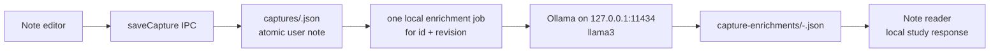

# Local Note Enrichment

**Status: implemented on `LLM-int`.** Revember saves a learner's note first, then generates a local study response without changing the note or its user-authored takeaways.

## Flow



Saving is successful once `CaptureStore` writes the capture. Generation is best-effort background work. An unavailable model or invalid model response never loses a note or turns a successful save into an error.

## Response contract

The main process truncates `rawText` to a Unicode-safe 12,000-character projection, splits it into bounded source segments, and assigns stable IDs. Ollama selects source IDs instead of copying or rewriting evidence:

```ts
{
  takeaways: { evidenceID: "S0001" | "S0002" | ... }[];
}
```

The `evidenceID` enum contains only bounded declarative source segments of at least three characters; headings, code fences, and question lines are never citable takeaways. Notes without a citable factual line fail with an actionable message instead of forcing junk into a result. The schema caps the selection count to the number of available unique IDs.

Revember rejects malformed output, unknown or duplicate IDs, and count or string-limit violations. It then reconstructs `evidence`, takeaway text, and the short summary from the selected source text, and extracts any explicit question lines without asking the model to generate questions. Before writing, the coordinator independently verifies every takeaway, evidence excerpt, and question against the exact model-visible source and verifies the deterministic summary. Persisted factual claims therefore remain extractive exact substrings rather than model-written paraphrases.

## Components

| Component | Responsibility |
| --- | --- |
| `CaptureStore` | Atomically writes the revisioned user note. |
| `NoteEnrichmentCoordinator` | Runs one request at a time and deduplicates `knowledgeRoot:captureID:revision`. |
| `OllamaNoteModel` | Calls `POST http://127.0.0.1:11434/api/generate` with `llama3`, enum-constrained source IDs, `think: false`, `num_ctx: 8192`, and `keep_alive: 0`. |
| `NoteEnrichmentStore` | Atomically stores `queued`, `running`, `ready`, `failed`, or `unavailable` results by capture ID and revision. |
| Renderer | Polls the matching revision and shows generation, result, or a retryable error. |

The reader only displays a result for the capture revision it has open. Editing a note creates a new revision and job. An old result remains historical and cannot replace the newer response. A persisted `queued` or `running` job resumes when its active note is reopened after an app restart. If a successful active-note save outlives a failed queue-status write, opening that current revision recreates the missing job. Archived notes never create or resume enrichment work.

## Constraints and decisions

- Do not start, download, or configure Ollama automatically. If `llama3` is absent or the local service is stopped, record `unavailable` and show the recovery message.
- Run one request at a time. Abort a request after two minutes so one hung local service cannot block the whole queue. Send `keep_alive: 0` so Ollama unloads the model after the response.
- Do not create cards, alter `concisePoints`, or write topic JSON in this release. The user remains the author of each learning artifact.
- Do not add spaCy now. spaCy can segment sentences, tag text, and extract noun chunks, but it cannot generate a grounded learning response. It may later provide deterministic note metadata if that need is measured.

Ollama supports local structured output and immediate model unloading with `keep_alive: 0`. See [its structured-output guide](https://docs.ollama.com/capabilities/structured-outputs) and [model-lifetime FAQ](https://docs.ollama.com/faq). spaCy's sentence and noun-phrase features are documented in its [linguistic features guide](https://spacy.io/usage/linguistic-features).

## Verification

`tests-electron/note-enrichment.test.ts` has 24 deterministic cases covering stable-ID materialization, strict schema/runtime rejection, exact text and evidence, concise facts, Unicode-safe truncation and chunking, the 12,000-character source cap, private enrichment files, unavailable Ollama with retry, restart resumption, root-scoped deduplication, archived-note safety, missing-job recovery, and serial request handling. The live check is opt-in through `REVEMBER_LIVE_CAPTURE_PATH`; it reads a capture and calls Ollama without changing that capture. Focused tests, type checking, and the production build pass. Electron E2E and package tests were not run for this change.
