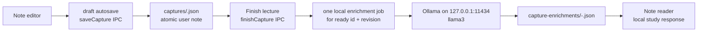

# Local Note Enrichment

**Status: implemented on `main`.** Revember saves draft notes without analysis. **Finish lecture** marks one revision ready and starts an optional local study response without changing the note or its user-authored takeaways.

## Flow



Saving is successful once `CaptureStore` writes the draft. Autosave never queues analysis. Finishing changes the current non-empty capture to `ready`, then queues best-effort background work. An unavailable model or invalid model response never loses a note or turns a successful save into an error.

## Response contract

The main process truncates `rawText` to a Unicode-safe 12,000-character projection, splits it into bounded source segments, and assigns stable IDs. Ollama selects source IDs instead of copying or rewriting evidence:

```ts
{
  takeaways: { evidenceID: "S0001" | "S0002" | ... }[];
}
```

The `evidenceID` enum contains only bounded declarative source segments of at least three characters; headings, code fences, and question lines are never citable takeaways. Notes without a citable factual line fail with an actionable message instead of forcing junk into a result. The schema caps the selection count to the number of available unique IDs.

Revember rejects malformed output, unknown or duplicate IDs, and count or string-limit violations. It then reconstructs `evidence`, takeaway text, and the short summary from the selected source text, and extracts any explicit question lines without asking the model to generate questions. Before writing, the coordinator independently verifies every takeaway, evidence excerpt, and question against the exact model-visible source and verifies the deterministic summary. Persisted factual claims therefore remain extractive exact substrings rather than model-written paraphrases.

## Components

| Component | Responsibility |
| --- | --- |
| `CaptureStore` | Atomically writes the revisioned user note. |
| `NoteEnrichmentCoordinator` | Runs one request at a time, deduplicates revisions, keeps only the latest pending revision, and aborts obsolete active work. |
| `OllamaNoteModel` | Calls `POST http://127.0.0.1:11434/api/generate` with `llama3`, enum-constrained source IDs, `think: false`, `num_ctx: 8192`, and `keep_alive: 0`. |
| `NoteEnrichmentStore` | Atomically stores `queued`, `running`, `ready`, `failed`, or `unavailable` results by capture ID and revision. |
| Renderer | Polls the matching revision and shows generation, result, or a retryable error. |

The reader only displays a result for the capture revision it has open. Editing creates a new `draft` revision but does not create a job. The learner must finish that revision explicitly. An old result remains historical and cannot replace a newer response. The coordinator supersedes queued older revisions and aborts obsolete active work.

A persisted `queued` or `running` job resumes when its ready note is reopened after an app restart. If a successful Finish Lecture save outlives a failed queue-status write, opening that current ready revision recreates the missing job. Draft and archived notes never create or resume enrichment work.

## Constraints and decisions

- Do not start, download, or configure Ollama automatically. If `llama3` is absent or the local service is stopped, record `unavailable` and show the recovery message.
- Do not run analysis during the 700 ms draft autosave. Only an explicit Finish Lecture action can queue a revision.
- Run one request at a time. Abort a request after two minutes so one hung local service cannot block the whole queue. Send `keep_alive: 0` so Ollama unloads the model after the response.
- Do not create cards, alter `concisePoints`, or write topic JSON in this release. The user remains the author of each learning artifact.
- Do not add spaCy now. spaCy can segment sentences, tag text, and extract noun chunks, but it cannot generate a grounded learning response. It may later provide deterministic note metadata if that need is measured.

Ollama supports local structured output and immediate model unloading with `keep_alive: 0`. See [its structured-output guide](https://docs.ollama.com/capabilities/structured-outputs) and [model-lifetime FAQ](https://docs.ollama.com/faq). spaCy's sentence and noun-phrase features are documented in its [linguistic features guide](https://spacy.io/usage/linguistic-features).

## Verification

`tests-electron/note-enrichment.test.ts` contains 24 deterministic cases. They cover stable-ID materialization, strict schema/runtime rejection, exact text and evidence, Unicode-safe truncation and chunking, the 12,000-character source cap, private enrichment files, explicit Finish Lecture gating, queue coalescing, obsolete-request cancellation, unavailable Ollama with retry, restart resumption, root-scoped deduplication, archived-note safety, missing-job recovery, and serial request handling.

The same file contains one opt-in live case. Set `REVEMBER_LIVE_CAPTURE_PATH` to a capture file to call the installed Ollama model without changing that capture.

`tests-electron/local-ai-e2e.mjs` launches the real Electron app against temporary local data and a deterministic fake Ollama endpoint. It verifies Finish Lecture, exact-source rendering, separate enrichment persistence, and unchanged raw note text.

Run the focused suite with:

```bash
npx vitest run tests-electron/note-enrichment.test.ts
```

Use the repository [verification matrix](../../README.md#build-and-verify) for the full release gate.
